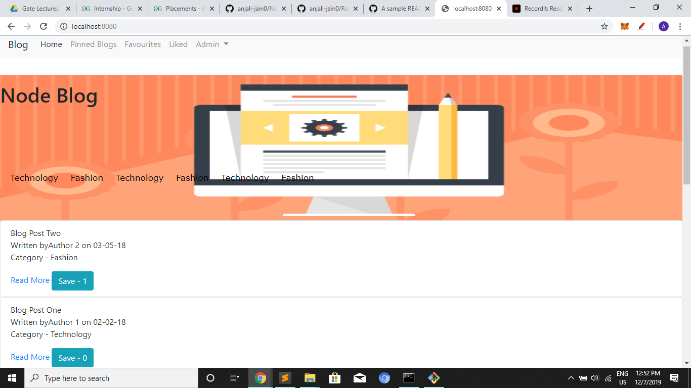
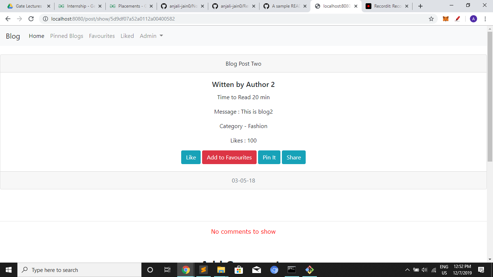
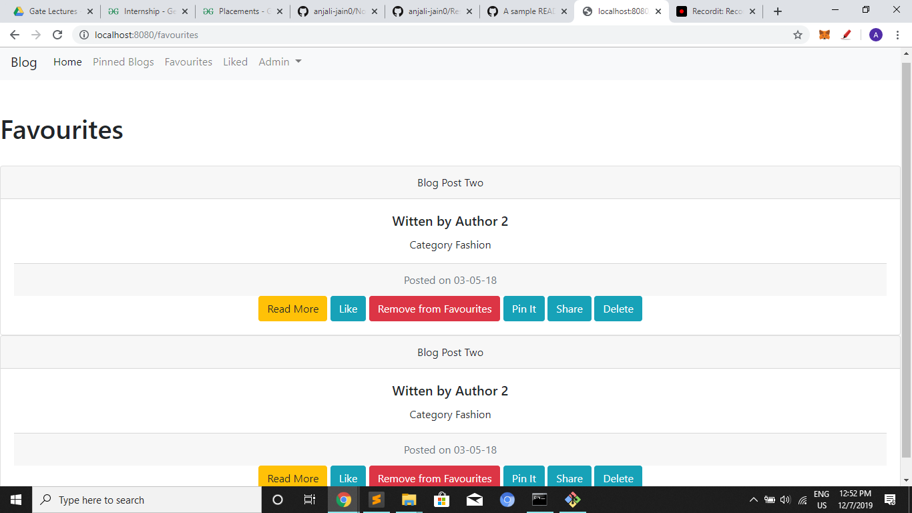

# Nodejs_Blogs

Web App to read recent blogs on various topics.

## Features
* View posts/blogs on various topics such as technology, fashion etc.
* Search for blogs written on specific topics.
* Save, share, add to favourites, like, delete and comment on blogs.
* Subscribe for recent blogs and other updates.

## Setup/Installation Requirements
* Download or clone git repo at https://github.com/anjali-jain0/Nodejs_Blogs.git
* Run npm install
* Run node index.js
* Index.js should open up on your default browser, if not, go to localhost:8080

## Screenshots
        

## Technologies Used
* HTML/CSS
* Javascript
* Jquery/Bootstrap
* NodeJS with Express(ejs template engine)
* Mongodb
